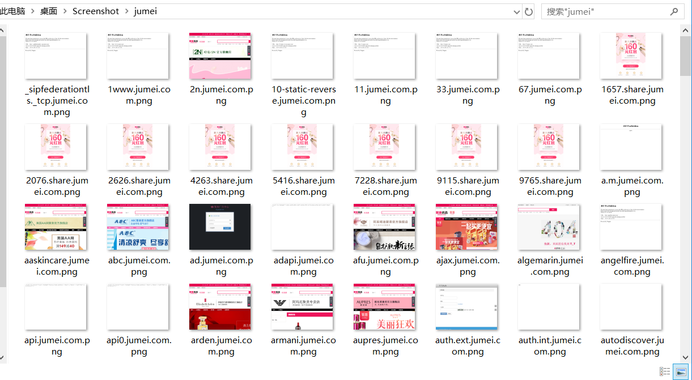

# Screenshots

A tiny batch web site screenshot tool -- 批量网站截图工具

使用无界面浏览器引擎批量地对页面进行渲染并截图，辅助渗透测试人员进行网站指纹识别。

## Installation

安装puppeteer及其相关依赖：https://github.com/GoogleChrome/puppeteer

```bash
git clone https://github.com/imp0wd3r/Screenshots
```

## Usage

### *nix

```bash
bash screenshot.sh /tmp/urls.txt result
```

Windows ( powershell )

```powershell
Set-ExecutionPolicy Bypass -Scope Process
 .\screenshot.ps1 -Targets C:\Users\p0wd3r\Desktop\urls.txt -Result result
```

**注**：`-Targets`参数的值需为绝对路径

执行上述命令后，结果会保存在result目录中

## Example



## Technical details

通过[puppeteer](https://github.com/GoogleChrome/puppeteer)调用[Headless Chrome](https://developers.google.com/web/updates/2017/04/headless-chrome)对页面进行渲染并截图，直接使用`screenshot.js`对单个文件中的多目标进行截图会大量消耗资源，所以通过bash/powershell脚本将目标文件分割成多个小文件再调用`screenshot.js`对其进行渲染。

## Reference

https://github.com/GoogleChrome/puppeteer

https://www.reddit.com/r/PowerShell/comments/6h86xn/how_to_split_file_by_of_lines_in_text_file/